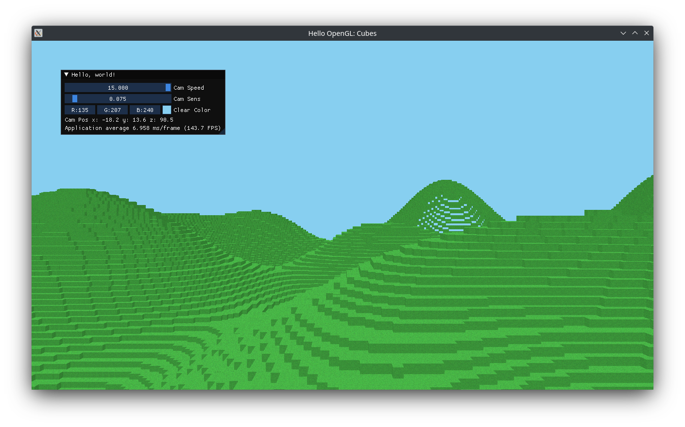

# HelloOpenGL
Hello World Program in OpenGL c++

A simple openGL app that renders a grid of cubes with texture, built with GLFW, GLEW and GLM.
Using ImGUI the position of the camera and camera speed is displayed.

### Screenshot

### Build
#### With Linux
Install the libraries and compiler:
On Arch:
`sudo pacman -S glfw glm glew clang make`
And then run make:
`make run`